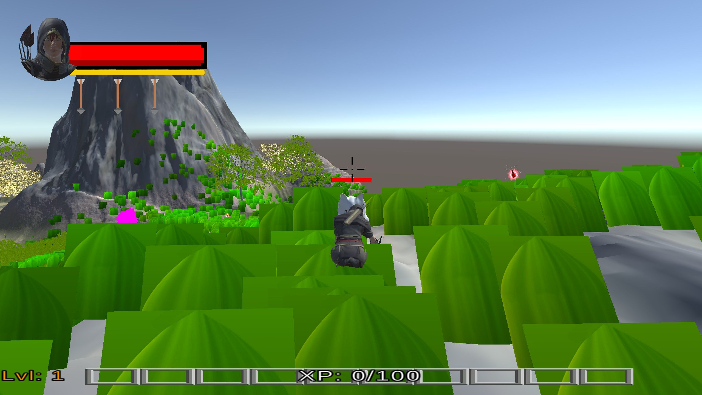

<!--- insert project logo here -->

<!--- general description of the project -->
This game is one of three developed as part of the video game programming course in the Computer Graphics master's program.

## :trophy: Features
  &nbsp;&nbsp; :small_orange_diamond: Endless gameplay  
  &nbsp;&nbsp; :small_orange_diamond: Experience system   
  &nbsp;&nbsp; :small_orange_diamond: Terrain  

## :page_facing_up: License
This project is available under the [MIT][ref-mit] license; see [LICENSE](LICENSE) for the full license text.

[ref-mit]:              https://opensource.org/licenses/MIT
